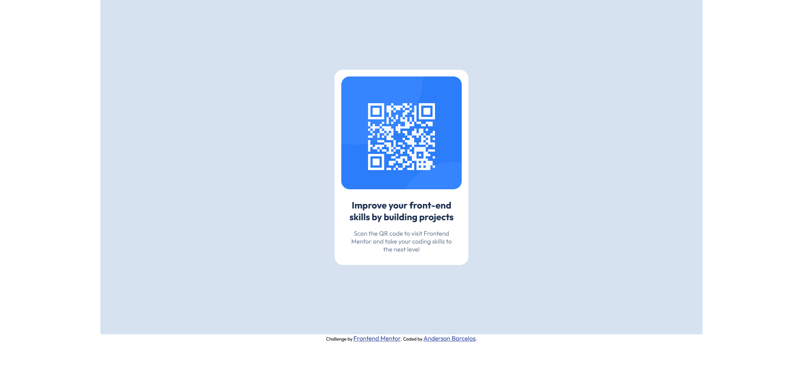

# Frontend Mentor - Solução de componente de QR-CODE

Esta é uma solução para o [desafio de componente de código QR no Frontend Mentor](https://www.frontendmentor.io/challenges/qr-code-component-iux_sIO_H).

## Índice

- [Visão geral](#visão geral)
- [Captura de tela](#captura de tela)
- [Links](#links)
- [Meu processo](#meu-processo)
- [Construído com](#construído-com)
- [O que aprendi](#o-que-aprendi)
- [Desenvolvimento contínuo](#desenvolvimento-contínuo)
- [Recursos úteis](#recursos-úteis)
- [Autor](#autor)
- [Agradecimentos](#agradecimentos)

## Visão geral

### Captura de tela

### Links

- URL da solução: [QR-CODE pub in Netlify](https://qr-code-newbie-frontend.netlify.app/)
- URL do site ativo: [QR-CODE pub in Netlify](https://qr-code-newbie-frontend.netlify.app/)

## Meu processo

### Criado com

- Marcação HTML5 semântica
- Propriedades personalizadas CSS

### O que aprendi
- Dimensionamento de telas
- alinhamento horizontal e vertical

## Autor

- Site - [Anderson Barcelos](https://www.linkedin.com/in/andersondebarcelos/)
- Mentor de front-end - [@AndersonLBarcelos](https://www.frontendmentor.io/profile/AndersonLBarcelos)
